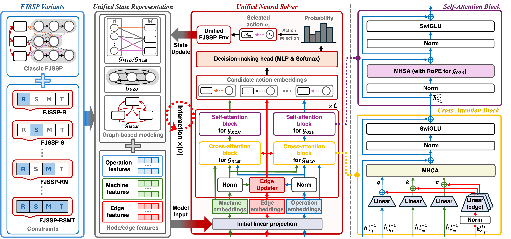

<h1 align="center">
Towards a Unified Model for 
  
Flexible Job Shop Scheduling with Diverse Constraints
</h1>

  
  
  

>This repository is the official implementation of our paper "**Towards a Unified Model for Flexible Job Shop Scheduling with Diverse Constraints**", The Fortieth Annual Conference on Neural Information Processing Systems (NeurIPS 2026).
>The code builds upon [DAN](https://github.com/wrqccc/fjsp-drl) repository. Our code will be released soon.

  

